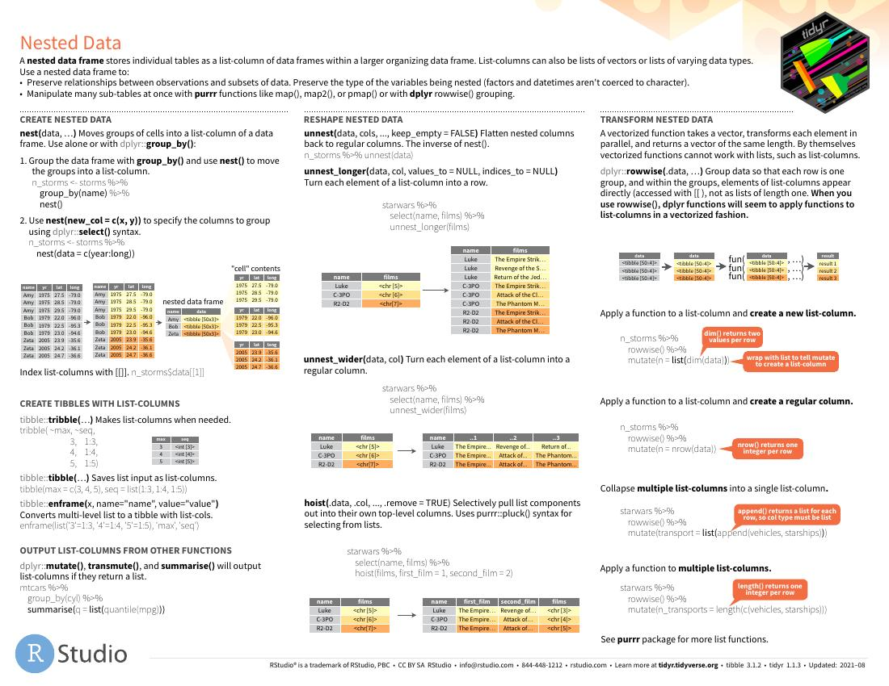
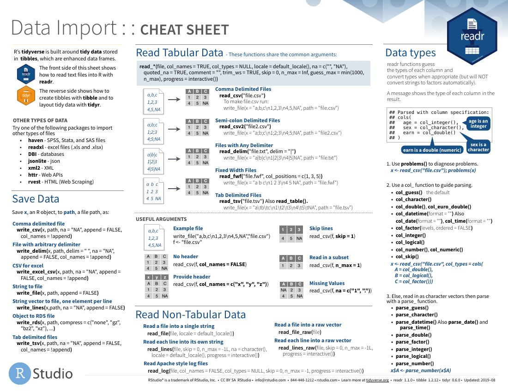
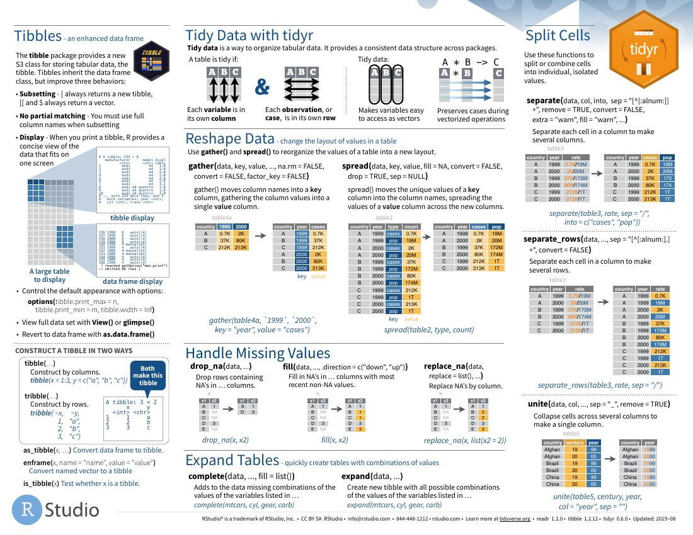
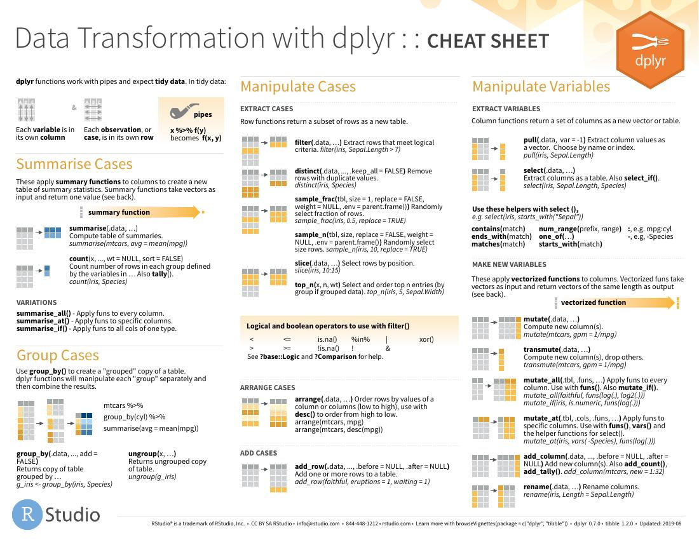
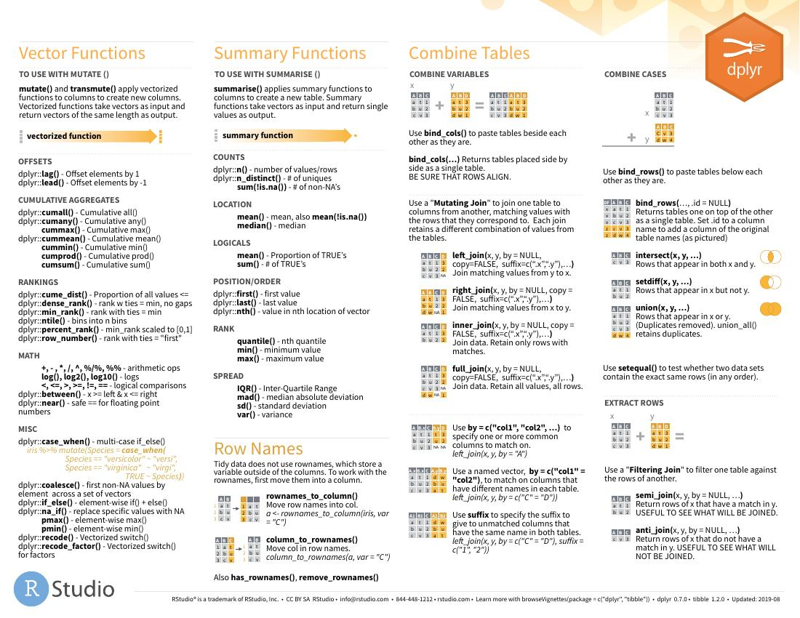
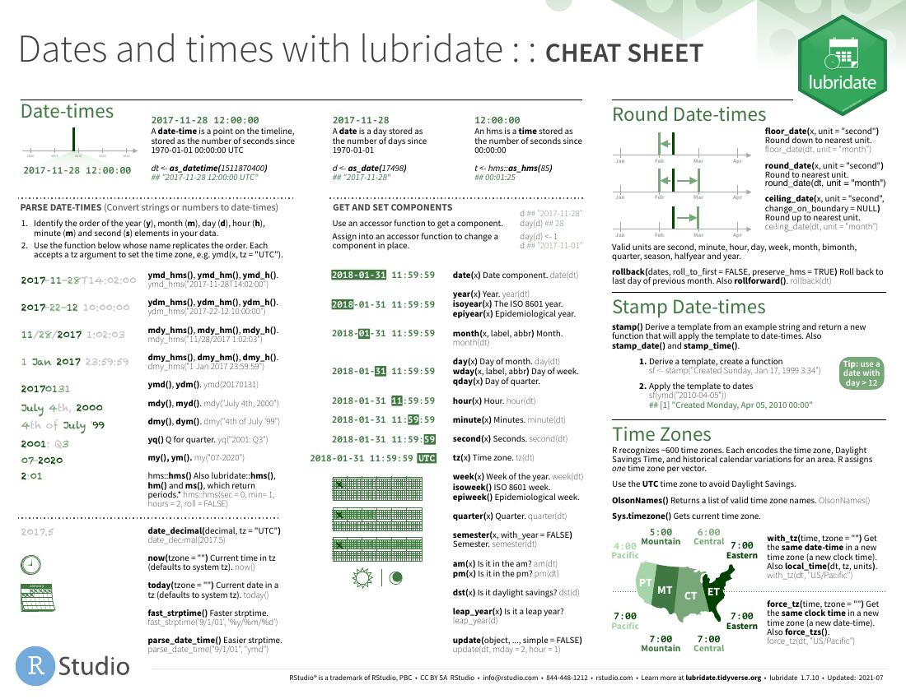
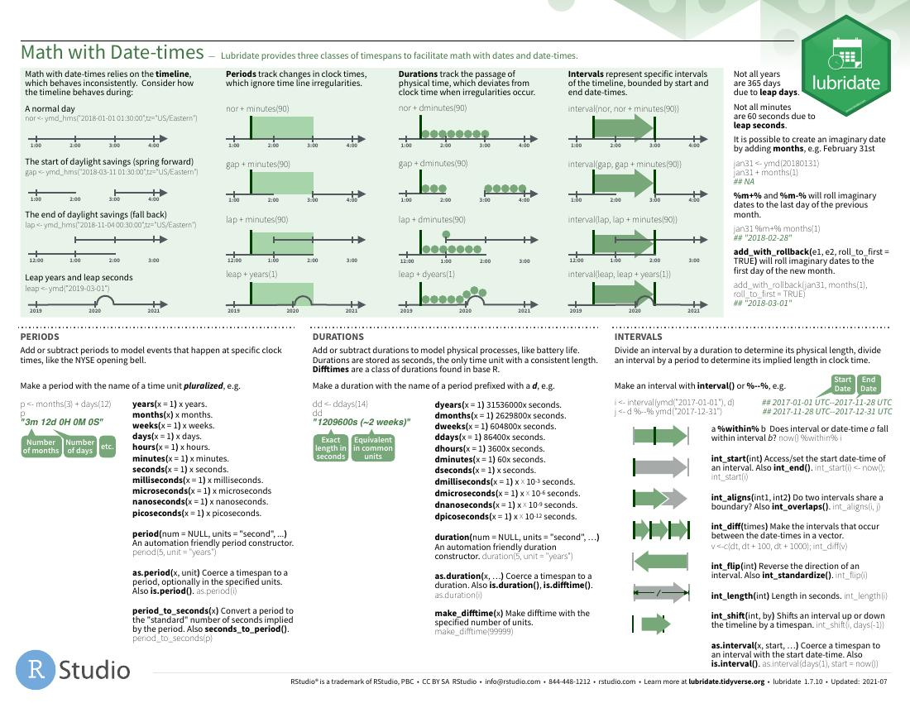
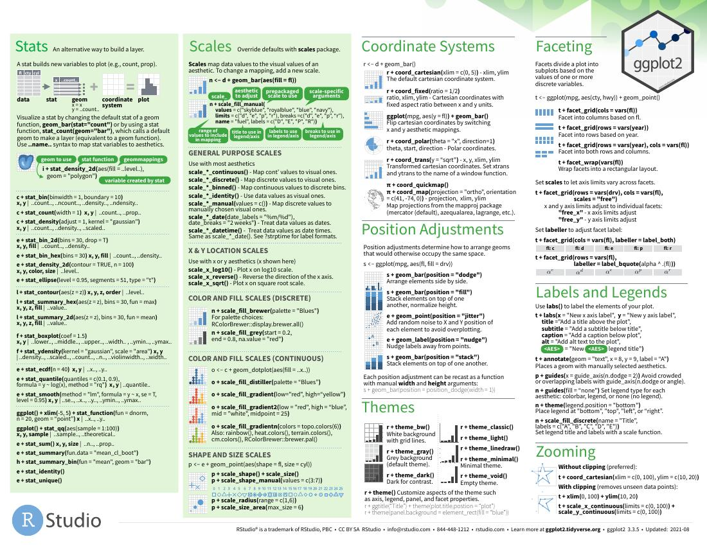

```{r setup, include=FALSE}
knitr::opts_chunk$set(echo = FALSE)

```


<script src="https://ajax.googleapis.com/ajax/libs/jquery/1.12.2/jquery.min.js"></script>

<script>
    $(document).ready(function() {
      $('slide:not(.title-slide, .backdrop, .segue)').append('<footer label=\"@AlexGCabanillas\"></footer>');    
    })
</script>

<style>
  footer:after {
    content: attr(label);
    font-size: 12pt;
    position: absolute;
    bottom: 620px;
    left: 710px;
    line-height: 1.9;
  }
</style>

## ¿Que es Tidyverse?
- [Creado por Hadley Wickham](https://hadley.nz/)
- Es un set de paquetes de R que evolucionan constantemente. 
- El objetivo es que permiten una manera de trabajar mas "limpia" (*"tidy"*).
- Trabaja siguiendo los principios de [*"tidy data"*](https://cran.r-project.org/web/packages/tidyr/vignettes/tidy-data.html)

## Principios para *"tidy data"*
- Cada variable forma una columna.
- Cada observación forma una fila.
- Cada unidad de observación forma una tabla.


```{r, echo = FALSE, out.width = "600px"}
knitr::include_graphics("./images/tidydataworkflow.png")
```
<font size="4"> [Taller de Tidyverse](https://www.youtube.com/watch?v=xLQ7L_mZ7YE&ab_channel=R-LadiesMadrid)</font>

## {.smaller}
```{r, echo = TRUE, cache=TRUE, include = TRUE}
library(palmerpenguins) #Set de datos para ejemplos
head(penguins)
```
<font size="4"> Básicamente un *data frame* con mas información.</font>


## Objetivos de un *"tidy workflow"*
- Reutilizar las estructuras de datos que existentes. 
- Construir funciones utilizando  *"pipelines"*( **%>% **).
- Trabajar usando programación funcional (construir programas aplicando funciones y repitiendo código).
- Hacer que el código sea mas fácil de leer para humanos. 

<font size="4"> Para aprender mas sobre por que se creo *"tidyverse"* lee el [manifesto del autor](https://cran.r-project.org/web/packages/tidyverse/vignettes/manifesto.html)</font>

## ¿Por que es importante?
<font size="14">*Happy families are all alike; every unhappy family is unhappy in its own way — Leo Tolstoy*</font>

- Aplicar el estilo *"tidyverse"* quiere decir que todos tus datos estarán en el mismo formato. 
- Evita tener que limpiar datos constantemente y de formas distintas. 
- Es una manera estandarizada de unir la estructura de diferentes datos y su semántica. 

<font size="4"> [Material Recomendado](https://www.rstudio.com/resources/cheatsheets/)</font>


## 
```{r,  echo = FALSE,include = FALSE} 
pdftools::pdf_convert("./images/tidyr.pdf",format = "jpeg",pages = 1, filenames = "./images/tidyr_1.jpeg")
pdftools::pdf_convert("./images/tidyr.pdf",format = "jpeg",pages = 2, filenames = "./images/tidyr_1.jpeg")
```
```{r,  echo = FALSE, out.width="100%"} 

```

##  
```{r, echo = FALSE, out.width="100%"} 

```

## Ejemplos{.smaller}

```{r, echo = TRUE, cache = TRUE}
library(tidyverse)
palmerpenguins:: penguins %>%
  group_by(species) %>% #Eligiendo la agrupación que nos interesa
  summarize(across(where(is.numeric), mean, na.rm = TRUE))
# Calculando la media por grupo para cada categoría

```

## 
```{r,  echo = FALSE,include = FALSE} 
pdftools::pdf_convert("./images/data-import.pdf",format = "jpeg",pages = 1, filenames = "./images/data-import_1.jpeg")
pdftools::pdf_convert("./images/data-import.pdf",format = "jpeg",pages = 2, filenames = "./images/data-import_2.jpeg")
```

```{r , echo = FALSE, out.width="100%"} 

```

##  
```{r , echo = FALSE, out.width="100%"} 

```

## 
```{r,  echo = FALSE,include = FALSE} 
pdftools::pdf_convert("./images/data-transformation.pdf",format = "jpeg", pages = 1, filenames = "./images/data-transformation_1.jpeg") 
pdftools::pdf_convert("./images/data-transformation.pdf",format = "jpeg", pages = 2, filenames = "./images/data-transformation_2.jpeg")
```

```{r , echo = FALSE, out.width="100%"} 

```

##  
```{r , echo = FALSE, out.width="100%"} 

```


## Trabajar con fechas
- Paquete recomendado para hacer que trabajar con fechas y horas sea menos frustrante: *"lubridate"*
- Su principal ventaja es que hace mucha mas difícil cometer errores con zonas horarias, años bisiestos, o cambios de hora de verano. 

Ejemplos: 

```{r , echo = TRUE} 
library(lubridate, warn.conflicts = FALSE)
ymd(20101215)

mdy("4/1/17")

time <- ymd_hms("2010-12-13 15:30:30")
time
force_tz(time, "America/Chicago")
```

## Operaciones con fechas y horas 
- Calcular cuanto tiempo ha pasado:

```{r , echo = TRUE} 
library(lubridate, warn.conflicts = FALSE)
duration(1.5, "minutes")

duration("2days 2hours 2mins 2secs")

#Puedes integrarlo a los operadores lógicos
duration("day 2 sec") > "day 1sec"

```


[Aquí podéis  leer el capitulo en trabajar con fechas y horas en R ](https://r4ds.had.co.nz/dates-and-times.html)


```{r,  echo = FALSE,include = FALSE} 
pdftools::pdf_convert("./images/lubridate.pdf",format = "jpeg", pages = 1, filenames = "./images/lubridate_1.jpeg")
pdftools::pdf_convert("./images/lubridate.pdf",format = "jpeg", pages = 2, filenames = "./images/lubridate_2.jpeg")
```

## 
```{r , echo = FALSE, out.width="100%"} 

```

##  
```{r , echo = FALSE, out.width="100%"} 

```

## Ggplot
- El sistema gráfico parte de *"tidyverse"*
- Esta basado en la ["gramatica de las graficas"](https://link.springer.com/book/10.1007/0-387-28695-0)
- Es una estructura basada en construir gráficas a base de capas. 
- Reduce una gráfica a un mapa de objetos con atributos estéticos. 
- Simplemente indica cuales son los datos (en un formato con la estructura *"tidy"*), que variables son de interés y que tipo de gráfico  quieres. Ggplot se encarga del resto. 
- Las opciones de personalización son casi infinitas. 

<font size="4">[Si no te he conseguido convencer aqui tenemos mas ejemplos](https://mandymejia.com/2013/11/13/10-reasons-to-switch-to-ggplot-7/)
</font>


## 
```{r,  echo = FALSE,include = FALSE} 
pdftools::pdf_convert("./images/data-visualization.pdf",format = "jpeg",pages = 1, filenames = "./images/data-visualization_1.jpeg")
pdftools::pdf_convert("./images/data-visualization.pdf",format = "jpeg",pages = 2, filenames = "./images/data-visualization_1.jpeg")
```

```{r , echo = FALSE, out.width="100%"} 

```

##  
```{r , echo = FALSE, out.width="100%"} 

```

## Ejemplo 
```{r, include = FALSE, cache=TRUE} 
library(ggplot2)
```


```{r ,warning=FALSE, echo = FALSE, out.width="100%", cache=TRUE} 
mass_flipper <- ggplot(data = penguins,
                       aes(x = flipper_length_mm,
                           y = body_mass_g)) +
  geom_point(aes(color = species,
                 shape = species),
             size = 3,
             alpha = 0.8) +
  theme_minimal() +
  scale_color_manual(values = c("darkorange","purple","cyan4")) +
  labs(title = "Penguin size, Palmer Station LTER",
       subtitle = "Flipper length and body mass for Adelie, Chinstrap and Gentoo Penguins",
       x = "Flipper length (mm)",
       y = "Body mass (g)",
       color = "Penguin species",
       shape = "Penguin species") +
  theme(legend.position = c(0.2, 0.7),
        legend.background = element_rect(fill = "white", color = NA),
        plot.title.position = "plot",
        plot.caption = element_text(hjust = 0, face= "italic"),
        plot.caption.position = "plot")

mass_flipper
```


<font size="4">[Source]( https://allisonhorst.github.io/palmerpenguins/articles/examples.html)</font>

## {.smaller}
```{r ,warning=FALSE, echo = TRUE ,eval = FALSE, cache=TRUE} 

mass_flipper <- ggplot(data = penguins,
                       aes(x = flipper_length_mm,
                           y = body_mass_g)) +
  geom_point(aes(color = species,
                 shape = species),
             size = 3,
             alpha = 0.8) +
  theme_minimal() +
  scale_color_manual(values = c("darkorange","purple","cyan4")) +
  labs(title = "Penguin size, Palmer Station LTER",
       subtitle = "Flipper length and body mass for Adelie, Chinstrap and Gentoo Penguins",
       x = "Flipper length (mm)",
       y = "Body mass (g)",
       color = "Penguin species",
       shape = "Penguin species") +
  theme(legend.position = c(0.2, 0.7),
        legend.background = element_rect(fill = "white", color = NA),
        plot.title.position = "plot",
        plot.caption = element_text(hjust = 0, face= "italic"),
        plot.caption.position = "plot")

mass_flipper
```


##

```{r ,warning=FALSE, echo = FALSE, out.width="100%", cache=TRUE} 
bill_len_dep <- ggplot(data = penguins,
                         aes(x = bill_length_mm,
                             y = bill_depth_mm,
                             group = species)) +
  geom_point(aes(color = species,
                 shape = species),
             size = 3,
             alpha = 0.8) +
  geom_smooth(method = "lm", se = FALSE, aes(color = species)) +
  theme_minimal() +
  scale_color_manual(values = c("darkorange","purple","cyan4")) +
  labs(title = "Penguin bill dimensions",
       subtitle = "Bill length and depth for Adelie, Chinstrap and Gentoo Penguins at Palmer Station LTER",
       x = "Bill length (mm)",
       y = "Bill depth (mm)",
       color = "Penguin species",
       shape = "Penguin species") +
  theme(legend.position = c(0.85, 0.15),
        legend.background = element_rect(fill = "white", color = NA),
        plot.title.position = "plot",
        plot.caption = element_text(hjust = 0, face= "italic"),
        plot.caption.position = "plot")

bill_len_dep
```

<font size="4">[Source]( https://allisonhorst.github.io/palmerpenguins/articles/examples.html)</font>


## {.smaller}
```{r ,warning=FALSE, echo = TRUE ,eval = FALSE, cache=TRUE} 
bill_len_dep <- ggplot(data = penguins,
                         aes(x = bill_length_mm,
                             y = bill_depth_mm,
                             group = species)) +
  geom_point(aes(color = species,
                 shape = species),
             size = 3,
             alpha = 0.8) +
  geom_smooth(method = "lm", se = FALSE, aes(color = species)) +
```


##

```{r ,warning=FALSE, echo = FALSE, out.width="100%", cache=TRUE} 
mass_hist <- ggplot(data = penguins, aes(x = body_mass_g)) +
  geom_histogram(aes(fill = species),
                 alpha = 0.5,
                 position = "identity") +
  scale_fill_manual(values = c("darkorange","purple","cyan4")) +
  theme_minimal() +
  labs(x = "Body mass (g)",
       y = "Frequency",
       title = "Penguin body mass")

mass_hist
```

<font size="4">[Source]( https://allisonhorst.github.io/palmerpenguins/articles/examples.html)</font>

## {.smaller}
```{r ,warning=FALSE, echo = TRUE ,eval = FALSE, cache=TRUE} 
bmass_hist <- ggplot(data = penguins, aes(x = body_mass_g)) +
  geom_histogram(aes(fill = species),
                 alpha = 0.5,
                 position = "identity") +
  scale_fill_manual(values = c("darkorange","purple","cyan4")) +
  theme_minimal() +
  labs(x = "Body mass (g)",
       y = "Frequency",
       title = "Penguin body mass")

mass_hist
```


## Ejemplo de combinar ambos

```{r,warning=FALSE, echo = FALSE, out.width="100%", cache=TRUE} 
library(tidyverse)
library(ggplot2)
library(palmerpenguins)
library(ggdist)      ## add uncertainity visualizations to ggplot2
library(glue)

theme_set(theme_classic()) 

## calculate bill ratio and summary stats
  penguins %>% 
  mutate(bill_ratio = bill_length_mm / bill_depth_mm) %>% 
  filter(!is.na(bill_ratio)) %>% 
  group_by(species) %>% 
  mutate(
    n = n(),
    median = median(bill_ratio),
    max = max(bill_ratio)
  ) %>% 
  ungroup() %>% 
  mutate(species_num = as.numeric(fct_rev(species))) %>% 
  ggplot(aes(bill_ratio, species_num, color = species)) +
  stat_summary(
    geom = "linerange",
    fun.min = function(x) -Inf,
    fun.max = function(x) median(x, na.rm = TRUE),
    linetype = "dotted",
    orientation = "y",
    size = .7
  ) +
  geom_point(
    aes(y = species_num - .15), 
    shape = "|",
    size = 5,
    alpha = .33
  ) +
  ggdist::stat_halfeye(
    aes(
      y = species_num,
      color = species,
      fill = after_scale(colorspace::lighten(color, .5))
    ),
    shape = 18,
    point_size = 3,
    interval_size = 1.8,
    adjust = .5,
    .width = c(0, 1)
  ) +
  geom_text(
    aes(x = median, label = format(round(median, 2), nsmall = 2)),
    stat = "unique",
    color = "white",
    family = "Open Sans",
    fontface = "bold",
    size = 3.4,
    nudge_y = .15
  ) +
  geom_text(
    aes(x = max, label = glue::glue("n = {n}")),
    stat = "unique",
    family = "Open Sans",
    fontface = "bold",
    size = 3.5,
    hjust = 0,
    nudge_x = .01,
    nudge_y = .02
  ) +
  coord_cartesian(clip = "off", expand = FALSE) +
  scale_x_continuous(
    limits = c(1.6, 3.8),
    breaks = seq(1.6, 3.8, by = .2)
  ) +
  scale_y_continuous(
    limits = c(.55, NA),
    breaks = 1:3,
    labels = c("Gentoo", "Chinstrap", "Adélie")
  ) +
  scale_color_manual(values = c("#3d6721", "#a86826", "#006c89"), guide = "none") +
  scale_fill_manual(values = c("#3d6721", "#a86826", "#006c89"), guide = "none") +
  labs(
    x = "Bill ratio",
    y = NULL,
    subtitle = "B. Raincloud plot showing the distribution of bill ratios, estimated as bill length divided by bill depth.",
    caption = "Data: Gorman, Williams & Fraser (2014) *PLoS ONE* &bull; Illustration: Allison Horst"
  ) +
  theme(
    panel.grid.major.x = element_line(size = .35),
    panel.grid.major.y = element_blank(),
    axis.text.y = element_text(size = 13),
    axis.ticks.length = unit(0, "lines"),
    plot.title.position = 'plot',
    plot.subtitle = element_text(margin = margin(t = 5, b = 10)),
    plot.margin = margin(10, 25, 10, 25)
  )

```
<font size="4"> [Source](https://z3tt.github.io/OutlierConf2021/)</font>

##  { .smaller} 

```{r,eval=FALSE,warning=FALSE, echo = TRUE, out.width="100%", cache=TRUE, size = "small"} 

library(ggdist)      ## add uncertainity visualizations to ggplot2

theme_set(theme_classic()) 

## calculate bill ratio and summary stats
  penguins %>% 
  mutate(bill_ratio = bill_length_mm / bill_depth_mm) %>% 
  filter(!is.na(bill_ratio)) %>% 
  group_by(species) %>% 
  mutate(
    n = n(),
    median = median(bill_ratio),
    max = max(bill_ratio)
  ) %>% 
  ungroup() %>% 
  mutate(species_num = as.numeric(fct_rev(species))) %>% 
  ggplot(aes(bill_ratio, species_num, color = species)) +
  stat_summary(
    geom = "linerange",
    fun.min = function(x) -Inf,
    fun.max = function(x) median(x, na.rm = TRUE),
    linetype = "dotted",
    orientation = "y",
    size = .7
  ) +
  geom_point(
    aes(y = species_num - .15), 
    shape = "|",
    size = 5,
    alpha = .33
  ) +
  ggdist::stat_halfeye(
    aes(
      y = species_num,
      color = species,
      fill = after_scale(colorspace::lighten(color, .5))
    ),
    shape = 18,
    point_size = 3,
    interval_size = 1.8,
    adjust = .5,
    .width = c(0, 1)
  ) +
  geom_text(
    aes(x = median, label = format(round(median, 2), nsmall = 2)),
    stat = "unique",
    color = "white",
    family = "Open Sans",
    fontface = "bold",
    size = 3.4,
    nudge_y = .15
  ) +
  geom_text(
    aes(x = max, label = glue::glue("n = {n}")),
    stat = "unique",
    family = "Open Sans",
    fontface = "bold",
    size = 3.5,
    hjust = 0,
    nudge_x = .01,
    nudge_y = .02
  ) +
  coord_cartesian(clip = "off", expand = FALSE) +
  scale_x_continuous(
    limits = c(1.6, 3.8),
    breaks = seq(1.6, 3.8, by = .2)
  ) +
  scale_y_continuous(
    limits = c(.55, NA),
    breaks = 1:3,
    labels = c("Gentoo", "Chinstrap", "Adélie")
  ) +
  scale_color_manual(values = c("#3d6721", "#a86826", "#006c89"), guide = "none") +
  scale_fill_manual(values = c("#3d6721", "#a86826", "#006c89"), guide = "none") +
  labs(
    x = "Bill ratio",
    y = NULL,
    subtitle = "B. Raincloud plot showing the distribution of bill ratios, estimated as bill length divided by bill depth.",
    caption = "Data: Gorman, Williams & Fraser (2014) *PLoS ONE* &bull; Illustration: Allison Horst"
  ) +
  theme(
    panel.grid.major.x = element_line(size = .35),
    panel.grid.major.y = element_blank(),
    axis.text.y = element_text(size = 13),
    axis.ticks.length = unit(0, "lines"),
    plot.title.position = 'plot',
    plot.subtitle = element_text(margin = margin(t = 5, b = 10)),
    plot.margin = margin(10, 25, 10, 25)
  )

```


## Recursos 
- [Taller sobre ggplot(Español)](https://www.youtube.com/watch?v=ttbntn_MfHU&ab_channel=R-LadiesMadrid)
- [Galeria de graficas en R utilizando ggplot.](https://www.r-graph-gallery.com/index.html) 
- [Guia para elegir el mejor tipo de grafica.](https://www.data-to-viz.com/)
- [A Comprehensive Guide to the Grammar of Graphics for Effective Visualization of Multi-dimensional Data](https://towardsdatascience.com/a-comprehensive-guide-to-the-grammar-of-graphics-for-effective-visualization-of-multi-dimensional-1f92b4ed4149)
- [Ejemplo para hacer un mapa y agregarle tus datos con ggplot ](https://conservancy.umn.edu/bitstream/handle/11299/220339/time-maps-tutorial-v2.html?sequence=3&isAllowed=y)
- [Ejemplo de mapas y datos interactivos](https://rstudio-pubs-static.s3.amazonaws.com/590924_f4d3fe16a75049cb96eedfc269df6f76.html)
- [Discusion sobre Tidyverse vs Base R](https://www.youtube.com/watch?v=DGhKBFaKLEE&ab_channel=R-LadiesGlobal)
