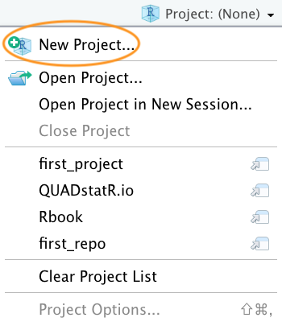
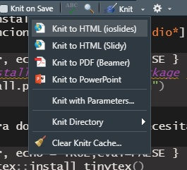
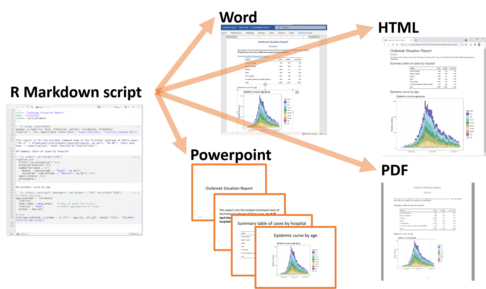
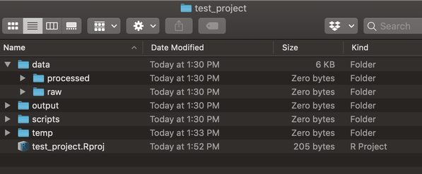
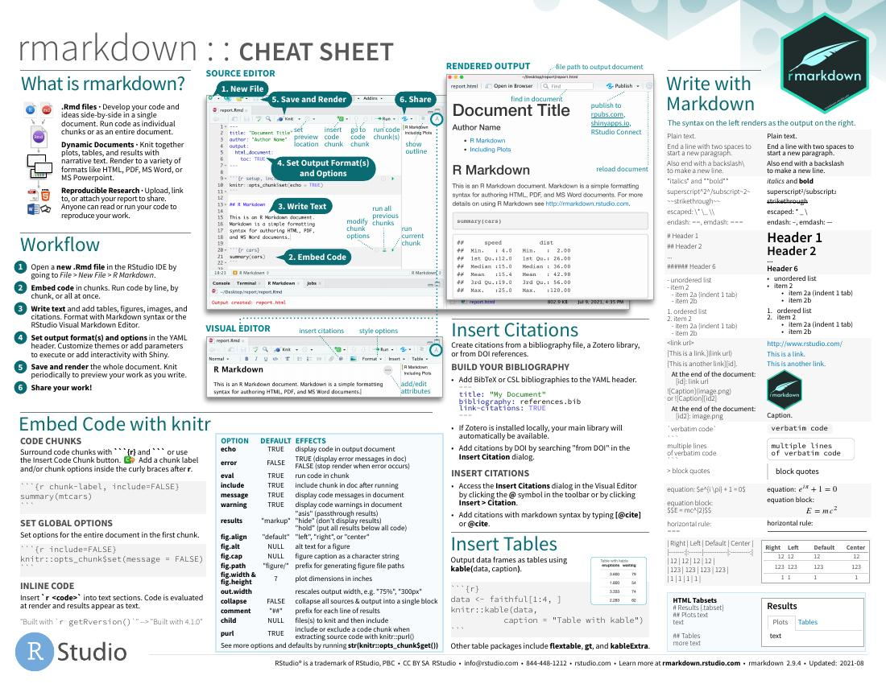
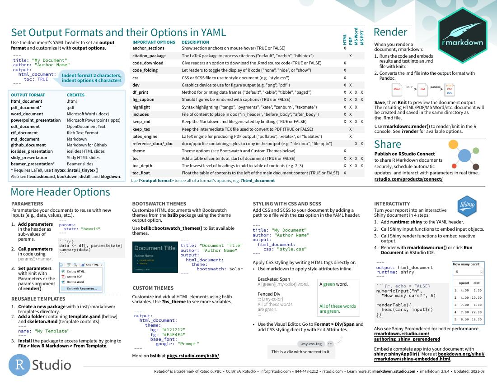
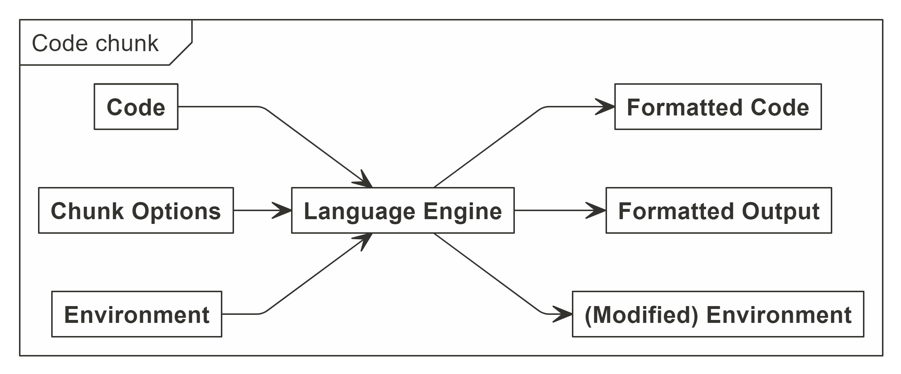

```{r setup, include=FALSE}
knitr::opts_chunk$set(echo = FALSE)

```

<script src="https://ajax.googleapis.com/ajax/libs/jquery/1.12.2/jquery.min.js"></script>

<script>
    $(document).ready(function() {
      $('slide:not(.title-slide, .backdrop, .segue)').append('<footer label=\"@AlexGCabanillas\"></footer>');    
    })
</script>

<style>
  footer:after {
    content: attr(label);
    font-size: 12pt;
    position: absolute;
    bottom: 620px;
    left: 710px;
    line-height: 1.9;
  }
</style>

## Que son los *projects* de Rstudio?
- Una manera de organizar tu *workflow*.
- Están automáticamente asociados con el *working directory* 
- Así que podemos dejar **setwd()** descansar en paz y evitar problemas de archivos que no están en su sitio. 


<font size="4"> El [*tweet*](https://twitter.com/hadleywickham/status/940021008764846080) y el [*post*](https://www.tidyverse.org/blog/2017/12/workflow-vs-script/) que me convirtieron a este método.</font>

## Estructura

<font size="10"> Cada proyecto tiene su propio: </font> 

- *directory * 
- *workspace * 
- *history* 
- *source documents*  

<font size="4">[Video](https://alexd106.github.io/intro2R/howto.html#rstudio_proj-vid) de como crear RStudio *Projects*.</font> 

## Ventajas
- Los análisis de diferentes proyectos se mantienen completamente separados. 
- Puedes tener abiertas varias sesiones de R a la vez sin que interfieran entre ellos. 
- El uso de *relatives paths* (**./**) automáticos.
- Las direcciones de los archivos se vuelven relativas en vez de absolutas facilitando trabajar en un proyecto desde varios ordenadores. 

## Como crear un *Project* nuevo

```{r,  figures-side, echo = FALSE,fig.show="hold", out.width="50%"}
knitr::include_graphics(("./images/new_proj.png"))


```


## Imagen de [@Allison Horst](https://twitter.com/allison_horst?lang=es)
```{r , echo = FALSE, out.width="100%"} 
knitr::include_graphics("./images/rmarkdown_rockstar.png")
```


## ¿Que es RMarkdown? 
- Es un formato de archivo para crear documentos dinámicos. 
- Es un formato de sintaxis simple que permite crear archivos de PDF, MS Word, MS Powerpoint y HTML. 
- Permite incluir código de R (*chunks*).
- Los archivos RMarkdown son la fuente para documentos reproducibles con código y figuras integrados.

Tutoriales de RMarkdown [Reportes en Markdown(Español)](https://www.youtube.com/watch?v=v5E8mBUtmZ8&ab_channel=R-LadiesMadrid), [Workshop en detalle de como utilizarlo](https://www.youtube.com/watch?v=l12RpPbZJUA&ab_channel=R-LadiesGlobal), [partes basicas](https://www.youtube.com/watch?v=tKUufzpoHDE&ab_channel=JalayerAcademy),

## Funciona en dos partes: {.columns-2}

- **knit**
  + Ejecuta el código dentro del documento. 
  + Utiliza el paquete **knitr**
  + El *output* del código se vera justo debajo del código que lo ha producido.
  + Significa que cuando cambias los datos de origen de la gráficas, estas se actualizan automáticamente.

```{r , echo = FALSE, out.width="90%"} 

```

## Funciona en dos partes:  {.columns-2}
- **convert**
  + Puedes convertir tu archivo a muchos formatos diferentes fácilmente. 
  + *Rmardown* utiliza el programa **pandoc** (esta automáticamente dentro de la instalación de rmarkdown). 
  + Significa que puedes compartir tu documento en una variedad de formatos isn tener que cambiar el original.
  
```{r , echo = FALSE, out.width="90%"} 

```

<font size="4">[Source](https://epirhandbook.com/en/reports-with-r-markdown.html)</font> 

## Instalacion 
- Funciona dentro de [*RStudio*](https://www.rstudio.com) 

```{r, echo = TRUE,eval=FALSE }
# install the rmarkdown package from CRAN in R
install.packages("rmarkdown")
``` 

- Para documentos de PDF necesitas *LaTeX*. La version de R es *TinyTeX*

```{r, echo = TRUE,eval=FALSE }
tinytex::install_tinytex()
# to uninstall TinyTeX, run
# tinytex::uninstall_tinytex()
``` 

<font size="4">[Aquí](https://tug.org/TUGboat/Contents/contents40-1.html)  puedes ver los detalles técnicos de  *TinyTeX* y [aquí](https://yihui.org/tinytex/faq/) los FAQ.</font> 

## 
```{r , echo = FALSE, out.width="100%"} 
knitr::include_graphics("./images/rmarkdown_wizards.png")
```


## ¿Como funciona?

```{r , echo = FALSE, out.width="100%"} 
knitr::include_graphics("./images/workflow.png")
```

## Anatomia de RMarkdown
- **YAML Header**
```{r, echo = TRUE,eval=FALSE }
---
title: "RProjects y RMarkdown"
author: Alejandra G.Cabanillas 
output: html_document
---
``` 
- Va al principio del documento.
- Lo lee *Pandoc*, *rmarkdown* y *knitr*.
- Describe que tipo de documento estas generando y es donde se realizan las modificacion de formato y *typesetting*.

<font size="4"> Para mas información ver este [video](https://www.youtube.com/watch?v=JgH_rIJUqZ8&ab_channel=JoshuaFrench), este [mini-curso](https://zsmith27.github.io/rmarkdown_crash-course/lesson-4-yaml-headers.html) o esta [sección ](https://monashdatafluency.github.io/r-rep-res/yaml-header.html) </font> 


## Ventajas
- Al integrar la creación de figuras con el análisis de datos puedes actualizar documentos de manera casi automática. 
- Facilita modificar figuras durante el proceso de edición. 
- Ahorra tiempo al hacer editar el formato deseado automáticamente (evita mover todo de sitio cuando cambias una imagen)

## Integracion con *Rstudio Projects*
- Lo único que debes hacer es guardar tu documento de markdown (**.Rmd**) en el directorio de el *Project*
- Cualquier imagen o datos que vayan a ser utilizados en el documento también deben estar en el mismo directorio. 

## Ejemplo de organizacion en un *Project*
```{r,  echo = FALSE, out.width="100%"} 

```


[Mas detalles aqui.](https://www.rforecology.com/post/organizing-your-r-studio-projects/)


## Differencias entre un *Script* y un documento de *Markdown*
- En un *script* todo es código que va  a ser ejecutado (menos los comentarios)
- En *R Markdown* solo los *chunks* son ejecutables. 
- Un archivo de  *R Markdown* es básicamente texto con secciones ejecutables. 
- Piensa en ello como un procesador de texto muy flexible con **R** integrado.

## 
```{r,  echo = FALSE,include = FALSE} 
pdftools::pdf_convert("./images/rmarkdown.pdf",format = "jpeg",pages = 1, filenames = "./images/rmarkdown_1.jpeg")
pdftools::pdf_convert("./images/rmarkdown.pdf",format = "jpeg",pages = 2, filenames = "./images/rmarkdown_2.jpeg")
```
```{r,  echo = FALSE, out.width="100%"} 

```

##  
```{r, echo = FALSE, out.width="100%"} 

```


## Integrando codigo de R en tu documento 
- Crean nuestros reportes dinámicos y mantienen el documento sincronizado.
- Funciona así:
```{r,  echo = FALSE, out.width="100%"} 

```

## Como inlcuir tu codigo:
- *Chunk*:
```{r, include=TRUE, echo=TRUE}
x <- 5  # radius of a circle
```
- *In-line*

Para un circulo con radio `r x`, su área es `r pi * x^2`.

- En la linea anterior los valores han sido calculados directamente desde las variables asignadas. En el documento se ve así :

```{r, eval = FALSE, echo= TRUE}
Para un circulo con radio `r x`, su área es `r pi * x^2`
```

## Opciones disponibles {.smaller}
- **include = FALSE ** Ejecuta el código pero no lo enseña en el documento. *R Markdown* puede utilizar ese *output* en el resto del documento. 
- **echo = FALSE** Evita que el código se ejecute. Pero enseña los resultados. Es una manera muy practica de incluir gráficos.   
- **message = FALSE ** Evita que los mensajes producidos por el código se muestren en el documento. Por ejemplo cuando instalamos paquetes o una gráfica no esta del todo ajustada. 
- **warning = FALSE ** Evita que se muestren los mensajes de error en el documento final. Es muy completamente cuando solo quieres enseñar un trozo de código complejo y no ejecutarlo completamente. 

Hay mas de 50 opciones que pueden modificar los *chunks* dependiendo de tus necesidades.

<font size="4">[Lista completa](https://yihui.org/knitr/options/)</font>

## Integrando imagenes 
- Puedes generarlas dentro de el documento.
- También puedes importarlas de otras plataformas. 

<font size="4">[Informacion basica sobre figuras en R Markdown](https://beatrizmilz.github.io/RStudio_Certification/slides.html#1) y [ aqui consejos y trucos](http://zevross.com/blog/2017/06/19/tips-and-tricks-for-working-with-images-and-figures-in-r-markdown-documents/)</font>

## Generando figuras
- Escribe el código necesario para generala dentro de un *chunk*
- Utiliza las opciones de los *chunks* para modificar el tamaño y agregar leyendas. 

<font size="4"> [Aqui para un ejemplo en detalle](https://rmd4sci.njtierney.com/figures-tables-captions-.html), también esta en mas detalle en el [seminario 2](https://1drv.ms/u/s!Aomb4AdHhFVyiMd-r4EuXL3ErTwKXA?e=M0z3S7). </font>

## Añadir una leyenda
- Simplemente vamos a agregar *fig.cap = "tu leyenda"* en las opciones del *chunk*

```{r mtcars, fig.cap = "Un ejemplo en R base", echo = TRUE, out.width="60%"}
plot(mpg ~ hp, mtcars)
```

## Añadir una imagen ya guardada
- Especifica donde esta.
- Que formato es. 
- El tamaño deseado. 
- También puedes utilizar **fig.cap** 

```{r,  echo = TRUE, eval = FALSE} 
``{r,  echo = FALSE, out.width="100%"} 

``
```
```{r,  echo = FALSE, out.width="60%"} 

```

## Que pasa si quieres aplicar un *script* externo? 

- Se utiliza de la misma manera que en un archivo **.R**
```{r, eval = FALSE, echo= TRUE}
source("your-script.R", local = knitr::knit_global())
# or sys.source("your-script.R", envir = knitr::knit_global())
```


## Programmatic reporting
- Cuando todo lo anterior es aplicado dentro de un documento tenemos lo que se conoce como *Programmatic reporting*.
- Un documento que se actualiza fácilmente cuando cambian los datos que se han utilizado para generarlo. 

## 
```{r,  echo = FALSE, out.width="100%"} 
knitr::include_graphics("./images/rmarkdown_translation.png")
```
<font size="4">[Source](https://epirhandbook.com/en/reports-with-r-markdown.html)</font> 


## Todo lo que ya habeis aprendido en version CV
- Programming Language: R
- Exploratory Data Analysis tools: tidyverse
- Dataviz tools: ggplot2
- Programmatic reporting: RMarkdown

<font size="4">[Source](https://twitter.com/charliejhadley/status/1516476148938649602)</font> 


## Referencias 
- [Reports en R Markdown](https://epirhandbook.com/en/reports-with-r-markdown.html)
- [R Markdown for Scientists](https://rmd4sci.njtierney.com/). Empieza aqui, tiene las explicacions breves y ejercicios.
- [R Markdown Cookbook](https://bookdown.org/yihui/rmarkdown-cookbook/) para todas las preguntas que se te puedan ocurrir. 
- [R Markdown: The Definitive Guide](https://bookdown.org/yihui/rmarkdown/)
